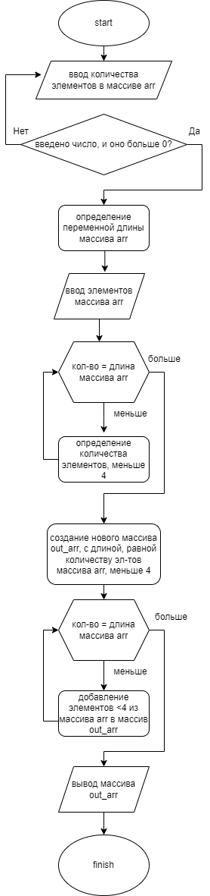

# <=3

### Программа, выделяющая из массива строк элементы меньше, либо равные трём.

Этапы:
* Ввод количества строк в массиве
* Проверка правильности ввода - должно быть введено положительное число
* Создание массива из поочерёдно вводимых строк
* Подсчет количества строк, короче четырёх элементов
* Создание нового массива из строк, короче четырёх
* Вывод нового массива строк

Блок схема программы:

 
